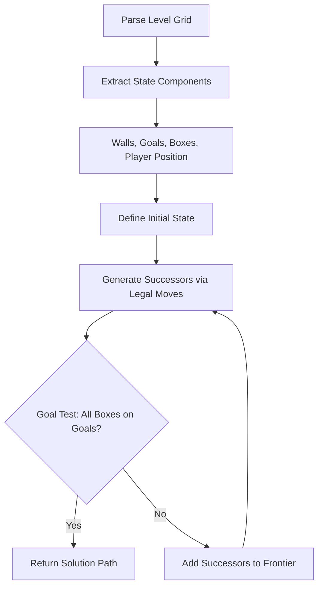
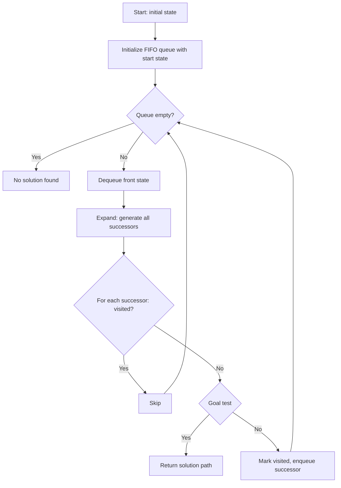
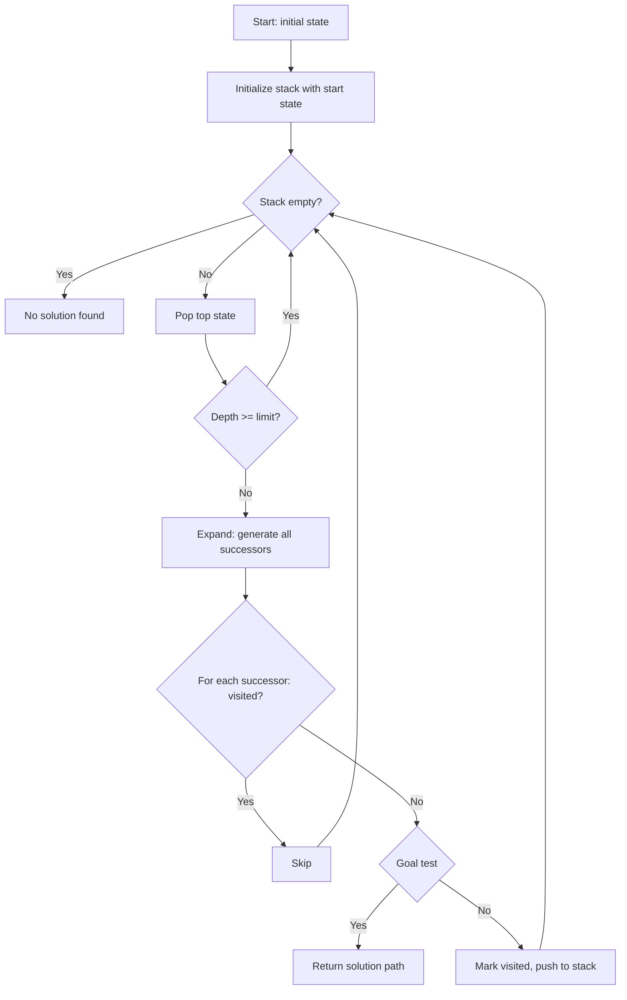
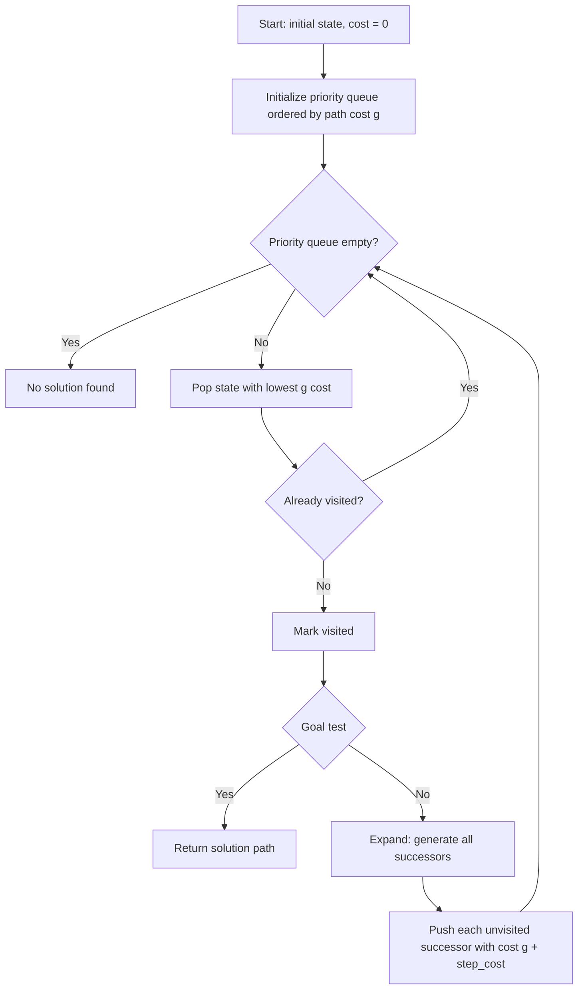
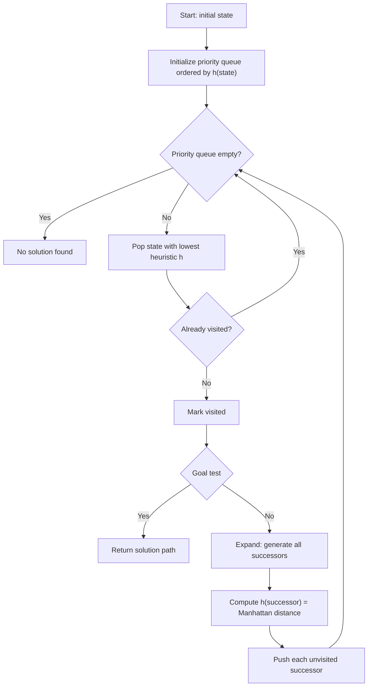
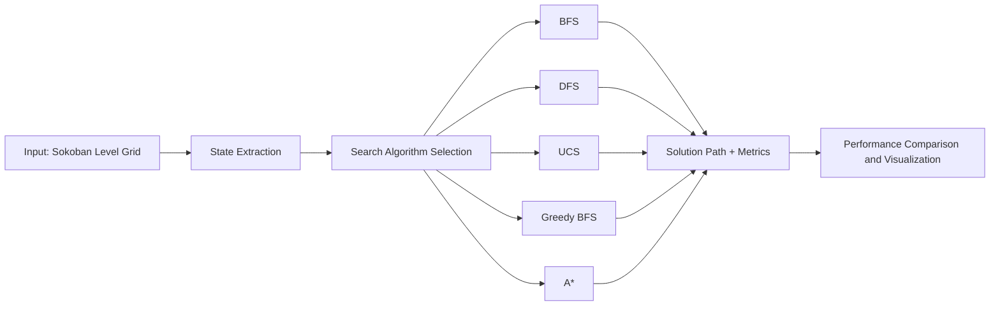
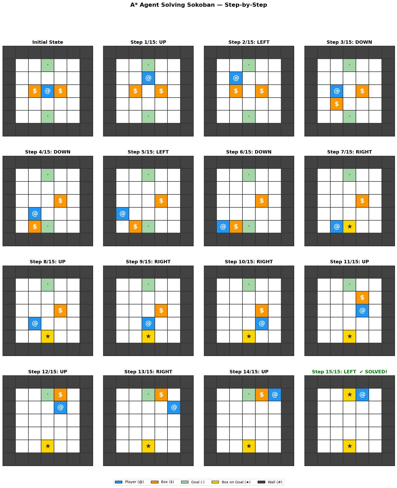

# Search Algorithms in Sokoban

An experimental study of classical search algorithms applied to the Sokoban puzzle. This project implements five search strategies -- BFS, DFS, UCS, Greedy Best-First Search, and A* -- models Sokoban as a formal search problem, and compares their performance on a standard test level.

---

## Table of Contents

- [About Sokoban](#about-sokoban)
- [Project Structure](#project-structure)
- [Algorithms Implemented](#algorithms-implemented)
- [How It Works](#how-it-works)
- [Algorithm Flow Diagrams](#algorithm-flow-diagrams)
- [Experimental Results](#experimental-results)
- [Visualizations](#visualizations)
- [How to Run](#how-to-run)
- [References](#references)

---

## About Sokoban

Sokoban (Japanese for "warehouse keeper") is a classic combinatorial puzzle. A player moves on a grid and must push boxes onto designated goal locations. The player can move in four cardinal directions (Up, Down, Left, Right) and can push -- but never pull -- one box at a time. The puzzle is solved when every box rests on a goal square.

Sokoban is known to be PSPACE-complete, making it an excellent benchmark for evaluating search algorithms.

**Test Level Used (7x7, 2 boxes, 2 goals):**

```
#######
#  .  #
#     #
# $@$ #
#     #
#  .  #
#######
```

| Symbol | Meaning         |
|--------|-----------------|
| `#`    | Wall            |
| ` `    | Floor           |
| `@`    | Player          |
| `$`    | Box             |
| `.`    | Goal            |
| `+`    | Player on Goal  |
| `*`    | Box on Goal     |

---

## Project Structure

```
Search-Algorithms-in-Sokoban/
|-- a-survey-on-classical-search-algorithms.ipynb   # Main notebook with all code and analysis
|-- README.md
|-- docs/
|   |-- Assignment1_AdvAI.pdf                       # Assignment specification
|-- images/
|   |-- agentworkingA.png                           # A* agent trace visualization
|   |-- mainfig.png                                 # Main architecture figure
|   |-- nodesExpanded.png                           # Nodes expanded bar chart
|   |-- qual_vs_search.png                          # Solution quality vs search efficiency
|   |-- radarchart.png                              # Multi-dimensional radar chart
```

---

## Algorithms Implemented

| Algorithm             | Strategy           | Optimal | Complete | Data Structure   |
|-----------------------|--------------------|---------|----------|------------------|
| BFS                   | Uninformed         | Yes     | Yes      | Queue (FIFO)     |
| DFS (depth-limited)   | Uninformed         | No      | No*      | Stack (LIFO)     |
| UCS                   | Uninformed         | Yes     | Yes      | Priority Queue   |
| Greedy Best-First     | Informed           | No      | No       | Priority Queue   |
| A*                    | Informed           | Yes     | Yes      | Priority Queue   |

\* DFS completeness depends on the depth limit.

**Heuristic (for informed searches):** Sum of minimum Manhattan distances from each box to its nearest goal position. This heuristic is admissible and consistent for Sokoban.

---

## How It Works

The Sokoban puzzle is modeled as a formal search problem:



**State representation:** Each state is a tuple `(player_position, frozenset_of_box_positions)`. This is hashable, allowing efficient duplicate detection via sets.

**Transition model:** For each of the four directions (Up, Down, Left, Right), the player attempts to move. If the target cell contains a box, and the cell beyond the box is free, the box is pushed. Moves into walls or into boxes that cannot be pushed are pruned.

---

## Algorithm Flow Diagrams

### BFS (Breadth-First Search)



### DFS (Depth-First Search with Depth Limit)



### UCS (Uniform Cost Search)



### Greedy Best-First Search



### A* Search


### Overall System Pipeline



---

## Experimental Results

All algorithms were run on the same 7x7 Sokoban level with 2 boxes and 2 goals. The results below are taken directly from the notebook output.

### Performance Comparison Table

| Algorithm   | Path Length | Nodes Expanded | Time (s)  | Optimal | Complete |
|-------------|------------|----------------|-----------|---------|----------|
| BFS         | 15         | 4309           | 0.094651  | Yes     | Yes      |
| DFS         | 199        | 4927           | 0.012571  | No      | No*      |
| UCS         | 15         | 5223           | 0.020785  | Yes     | Yes      |
| Greedy BFS  | 15         | 36             | 0.000198  | No      | No       |
| A*          | 15         | 2465           | 0.013979  | Yes     | Yes      |

\* DFS completeness depends on depth limit (set to 200 in this experiment).

### Key Observations

- **BFS, UCS, and A*** all found the optimal solution of 15 moves.
- **DFS** found a solution of 199 moves -- valid but far from optimal, as expected from a depth-first strategy.
- **Greedy BFS** expanded only 36 nodes, making it the fastest, but it does not guarantee optimality.
- **A*** strikes the best balance: it finds the optimal path (15 moves) while expanding significantly fewer nodes (2465) than BFS (4309) or UCS (5223).
- **UCS** expanded the most nodes (5223) because all step costs are uniform (cost = 1), making it behave similarly to BFS but with added priority queue overhead.

---

## Visualizations

The notebook generates several charts comparing algorithm performance. The images below are produced by the notebook code.

### Nodes Expanded by Algorithm


### Solution Quality vs Search Efficiency


### Multi-Dimensional Radar Chart


### A* Agent Working Trace



---

## How to Run

### Requirements

- Python 3.7+
- Jupyter Notebook or JupyterLab
- Required packages: `numpy`, `pandas`, `matplotlib`

### Steps

1. Clone the repository:
   ```bash
   git clone https://github.com/SaurabMishra12/Search-Algorithms-in-Sokoban.git
   cd Search-Algorithms-in-Sokoban
   ```

2. Install dependencies:
   ```bash
   pip install numpy pandas matplotlib
   ```

3. Open and run the notebook:
   ```bash
   jupyter notebook a-survey-on-classical-search-algorithms.ipynb
   ```

4. Execute all cells sequentially. The notebook will:
   - Parse the Sokoban level
   - Run all five search algorithms
   - Print the performance comparison table
   - Generate visualization charts

---

## References

- Sokoban puzzle: [https://en.wikipedia.org/wiki/Sokoban](https://en.wikipedia.org/wiki/Sokoban)
- Russell, S., Norvig, P. *Artificial Intelligence: A Modern Approach* -- for BFS, DFS, UCS, Greedy BFS, and A* algorithm descriptions
- PSPACE-completeness of Sokoban: Culberson, J. (1997). *Sokoban is PSPACE-complete.*
